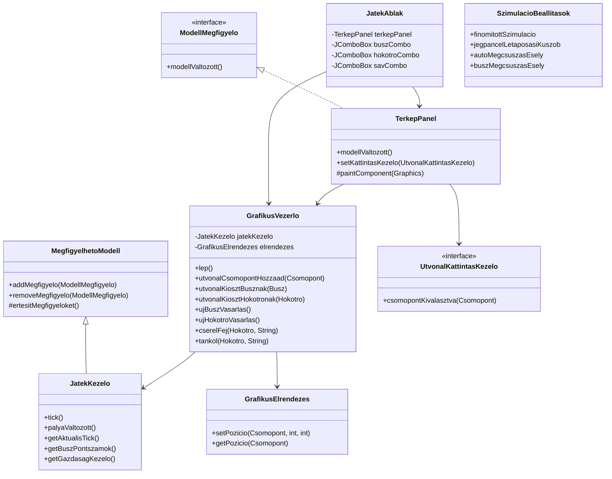

# Grafikus felulet terv es implementacio

## Cel

A grafikus felulet a meglevo szoveges prototipus melle kerult be. A regi bemeneti fajlok es a `Main` tovabbra is hasznalhatok, a grafikus program kulon `GrafikusMain` belepesi ponttal indul.

## Futtatas

Windows alatt:

```bat
cd skeleton
run_gui.bat
```

Kezi futtatas:

```bat
cd skeleton
javac -encoding UTF-8 -d bin src\*.java
java -cp bin GrafikusMain
```

## Felhasznaloi kep

A foablak harom reszbol all:

- kozepen a palya rajza,
- jobb oldalon szerepkor alapu vezerlopanel,
- alul statuszsor.

Kb. kepernyokep:

```text
+------------------------------------------------------+----------------------+
| Fajl  Szimulacio                                     | Buszvezetok | ...    |
|                                                      | Busz: [B1 v]         |
|        [L/G] A -------- S1/S2 -------- B [V]          |                      |
|              \                    |                  | Utvonal: A -> B      |
|               \ S6                | S3               | [Utvonal busznak]    |
|                \                  |                  | [Uj busz vasarlasa]  |
|                 D -------- S4 ---- C [M]             |                      |
|                [V]        S5                         | Takaritok fulon:     |
|                                                      | Hokotro: [H1 v]      |
|  Zold vonal: eppen kijelolt jatekos utvonal          | [Utvonal hokotronak] |
|  Jarmuvek: piros A, kek B, narancs H                 | [Fejcsere garazsban] |
+------------------------------------------------------+----------------------+
| Tick: 0 | Kassza: 1000 Ft | Busz fordulok: 0 | Buszok: 1 | Hokotrok: 1       |
+-----------------------------------------------------------------------------+
```

## Jelolesek

- Csomopont: sotet kor, benne azonosito.
- Sav: vastag vonal. Mellette a sav azonositoja.
- Kijelolt utvonal: zold csomopontok es zold vonal.
- Auto: piros negyzet, `A` betuvel.
- Busz: kek negyzet, `B` betuvel.
- Hokotro: narancs negyzet, `H` betuvel.
- Megcsuszott jarmu: sarga korvonal es felkialtojel.
- Lakas: `L`, munkahely: `M`, vegallomas: `V`, garazs: `G`.

Savszinek:

- tiszta: szurke,
- havas: vilagos szurke,
- jegpancel: vilagoskek,
- sozott: sargas,
- blokkolt: sotetszurke.

## Vezerles

Menu:

- `Fajl / Uj demo palya`: uj grafikus demo palya betoltese.
- `Fajl / Kilepes`: ablak bezarasa.
- `Szimulacio / Egy tick`: egy szimulacios lepes.
- `Szimulacio / Automata inditas`: idozitett leptetes.
- `Szimulacio / Automata megallitas`: idozitett leptetes leallitasa.

Jobb oldali fulek:

- `Buszvezetok`: busz kivalasztasa, kattintassal osszerakott utvonal buszhoz rendelese, uj busz vasarlasa.
- `Takaritok`: hokotro kivalasztasa, kattintassal osszerakott utvonal hokotrohoz rendelese, fejcsere, so/biokerozin/zuzalek vasarlasa, uj hokotro vasarlasa.
- `Varos`: szimulacio leptetese es teszteleshez hasznos idojaras/sav muveletek.

Utvonal kijelolese:

1. A jatekos a terkepen csomopontokra kattint.
2. A rendszer csak szomszedos csomopontot enged hozzaadni.
3. A kijelolt utvonal zold jelolest kap.
4. A buszvezeto a `Utvonal kiosztasa busznak`, a takarito a `Utvonal kiosztasa hokotronak` gombbal adja ki a parancsot.

## Mukodesi elv

A modell nem rajzol. A grafikus reteget a `GrafikusVezerlo`, `JatekAblak` es `TerkepPanel` osztalyok alkotjak. A `JatekKezelo` megfigyelheto objektum lett: tick vagy palyavaltozas utan ertesiti a feliratkozott nezeteket. A nezet ezutan lekerdezi a modell publikus olvaso metódusait, es sajat felelossegben rajzol.

A jatekosok nem kozvetlenul mozgatjak a jarmuveket. A feluleten parancsot adnak: a buszvezeto busz utvonalat, a takarito hokotro utvonalat jelol ki. A tenyleges mozgas a szimulacio tickjeiben tortenik.

A grafikus jatek finomitott szimulacios beallitasokkal fut. A jegpancel lassabban alakul ki, a jarmuvek jegen csak valoszinuseg alapjan csusznak meg, es idonkent gyenge havazas erkezik. A konzolos szkeleton tesztek alapertelmezetten megtartjak a regi determinisztikus viselkedest.

Ez azt jelenti, hogy mas megjelenito, peldaul webes vagy VR kliens is ugyanigy feliratkozhatna, majd sajat formatumban jelenithetne meg ugyanazt a modellt.

## Uj es modositott osztalyok



## Modellvaltozasok

Minimalis, megjelenitestol fuggetlen valtozasok tortentek:

- `JatekKezelo` megfigyelheto lett, es tick utan ertesit.
- `JatekKezelo.palyaValtozott()` kulso vezerlo altali allapotvaltozas utan ertesit.
- `ForgalomIranyito.getJarmuvek()` olvashato jarmulistat ad.
- `UtvonalTervezo.getUtak()` olvashato uthalozatot ad.
- `Utszakasz.getEleje()` es `getVege()` a rajzolashoz szukseges topologiat adja.
- `Jarmu` publikus gettereket kapott az aktualis savra, poziciora, sebessegre es allapotra.
- `Sav.toString()` es `Jarmu.toString()` a grafikus listakban olvashato azonositot ad.
- A grafikus vezerlo a kijelolt csomopontsort modellbeli `Utszakasz[]` utvonalla alakitja, majd a meglevo `UtvonalatKijelol` muvelettel adja at busznak vagy hokotronak.
- `SzimulacioBeallitasok` kapcsolja a grafikus jatek finomitott, lassabb es valoszinusegi szabalyait.

Rajzolasi adat, szin, meret, ikon vagy kepernyokoordinata nem kerult a modellbe.

## Grafikus palyaformatum

A regi szoveges palya- es tesztformatum valtozatlanul ervenyes.

A grafikus megjeleniteshez opcionális elrendezes adat kell, amely csomopontokhoz rendel kepernyokoordinatat. Jelenleg ezt a `GrafikusElrendezes` tarolja a demo palya epitesekor:

```text
csomopont_id x y
A 80 100
B 300 90
C 540 110
D 760 140
E 120 320
F 340 300
G 560 330
H 780 360
I 170 560
J 420 540
K 680 560
```

Ha kesobb fajlbol olvassuk, eleg ezt kulon fajlkent kezelni. A modell csak azt tudja, hogy A es B csomopont kozott van ut; azt nem, hogy A a kepernyon bal fent jelenik meg.

## Tesztelhetoseg

A regi szoveges tesztek tovabbra is a `Main` belepesi ponttal futnak. A grafikus resz kulon indul, ezert nem valtoztatja meg a konzolos prototipus kimenetet.
